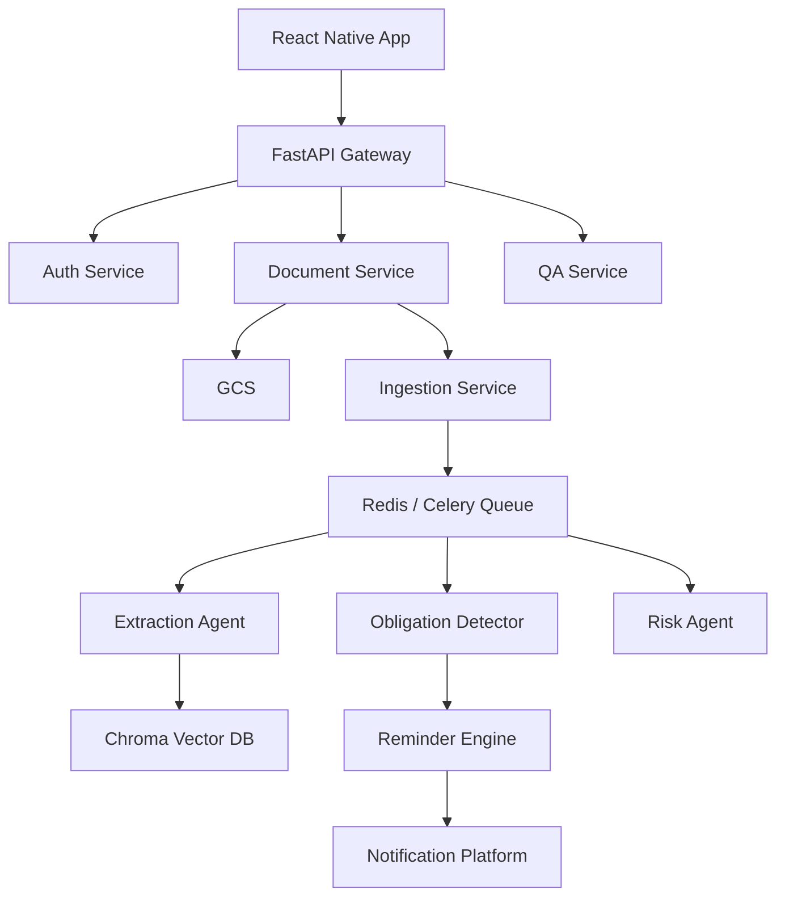
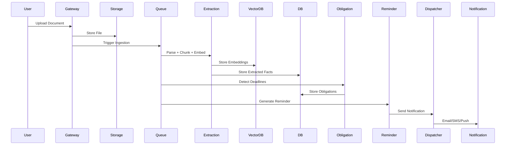

# Life Admin AI

An AI-powered multi-agent system that helps users manage important life documents such as insurance policies, contracts, agreements, and subscriptions.

---

## 🚀 Problem Statement

Managing life documents manually is difficult. Users often miss:

- Expiry dates
- Important obligations
- Risky clauses
- Renewal reminders
- Contract understanding

Life Admin AI solves this using AI agents.

---

## 🧠 Core Features

- Document ingestion & parsing
- Knowledge extraction
- Risk analysis
- Obligation & reminder generation
- AI-powered document Q&A

---

## 🏗️ Architecture Overview

Mobile App(React Native) -> API Gateway(FastAPI) -> Agent Orchestrator -> Multi-Agent System


---

## 🤖 AI Agents

| Agent | Responsibility |
|--------|-------------|
| Ingestion Agent | File storage and text extraction |
| Extraction Agent | Extract structured knowledge |
| Risk Agent | Detect risky clauses |
| Obligation Agent | Create reminders and obligations |
| QA Agent | Document-based question answering |

---

## 🧰 Tech Stack

### Backend
- FastAPI
- PostgreSQL
- Redis
- Celery
- LangGraph

### AI
- OpenAI
- Chroma Vector DB

### Storage
- Google Cloud Storage (GCS)

### Frontend
- React Native

---

## 📄 Supported Document Types

- PDF: `.pdf`
- Text: `.txt`, `.md`
- Word: `.docx`
- Spreadsheets: `.csv`, `.xlsx`, `.xls`
- Images (OCR): `.jpg`, `.jpeg`, `.png`
- Email files: `.eml`, `.msg`
- HTML: `.html`, `.htm`

---

## 📊 Development Roadmap

See [ROADMAP.md](ROADMAP.md)

---

## 📚 Documentation

All system documentation is inside `/docs`
- Production readiness tracker: [`docs/production_readiness_checklist.md`](docs/production_readiness_checklist.md)

---

## ⚡ Getting Started

Coming soon...

---

## 📜 License

MIT License
```
document_intelligence_ai
├─ .benchmarks
├─ Docker-compose.yml
├─ README.md
├─ ROADMAP.md
├─ alembic.ini
├─ docs
│  ├─ agents_design.md
│  ├─ data_model.md
│  ├─ scalability_plan.md
│  ├─ sdlc_plan.md
│  ├─ system_design.md
│  └─ vision.md
├─ document_intelligence_ai.code-workspace
├─ gateway
│  ├─ __init__.py
│  ├─ api
│  │  ├─ __init__.py
│  │  └─ v1
│  │     ├─ __init__.py
│  │     ├─ auth_routes.py
│  │     ├─ document_routes.py
│  │     ├─ notification_routes.py
│  │     └─ qa_routes.py
│  ├─ dependencies
│  │  └─ auth.py
│  └─ main.py
├─ infrastructure
│  └─ Dockerfile
├─ migrations
│  ├─ README
│  ├─ env.py
│  ├─ script.py.mako
├─ pytest.ini
├─ requirements.txt
├─ services
│  ├─ __init__.py
│  ├─ auth_service
│  │  ├─ __init__.py
│  │  └─ auth_service.py
│  ├─ document_service
│  │  ├─ __init__.py
│  │  └─ document_service.py
│  ├─ extraction_service
│  │  ├─ __init__.py
│  │  ├─ chunking_service.py
│  │  ├─ extraction_llm.py
│  │  ├─ extraction_pipeline.py
│  │  ├─ extraction_prompt.py
│  │  ├─ extraction_repository.py
│  │  └─ vector_service.py
│  ├─ ingestion_service
│  │  ├─ __init__.py
│  │  ├─ ingestion_pipeline.py
│  │  └─ parser_service.py
│  ├─ notification_service
│  │  ├─ __init__.py
│  │  ├─ fallback_engine.py
│  │  ├─ notification_repository.py
│  │  ├─ notification_router.py
│  │  ├─ notification_service.py
│  │  ├─ notification_templates.py
│  │  ├─ preference_engine.py
│  │  ├─ preference_repository.py
│  │  ├─ providers
│  │  │  ├─ __init__.py
│  │  │  ├─ base_provider.py
│  │  │  ├─ email_provider.py
│  │  │  ├─ push_provider.py
│  │  │  └─ sms_provider.py
│  │  └─ retry_engine.py
│  ├─ obligation_service
│  │  ├─ __init__.py
│  │  ├─ llm_validator.py
│  │  ├─ obligation_detector.py
│  │  ├─ obligation_repository.py
│  │  ├─ recurrence_engine.py
│  │  ├─ reminder_generator.py
│  │  ├─ reminder_repository.py
│  │  ├─ rule_engine.py
│  │  └─ schemas.py
│  ├─ privacy_service
│  │  ├─ __init__.py
│  │  └─ pii_redactor.py
│  ├─ qa_service
│  │  ├─ prompt_service.py
│  │  ├─ qa_pipeline.py
│  │  └─ retriever_service.py
│  ├─ risk_service
│  │  ├─ __init__.py
│  │  ├─ risk_detector.py
│  │  └─ risk_repository.py
│  └─ storage_service
│     ├─ __init__.py
│     └─ storage_service.py
├─ shared
│  ├─ __init__.py
│  ├─ config
│  │  ├─ __init__.py
│  │  └─ settings.py
│  ├─ database
│  │  ├─ __init__.py
│  │  ├─ base.py
│  │  └─ session.py
│  ├─ models
│  │  ├─ __init__.py
│  │  ├─ document.py
│  │  ├─ document_version.py
│  │  ├─ extracted_fact.py
│  │  ├─ notification_preference.py
│  │  ├─ obligation.py
│  │  ├─ reminder.py
│  │  ├─ risk.py
│  │  └─ user.py
│  └─ schemas
│     ├─ __init__.py
│     ├─ document_schema.py
│     └─ user_schema.py
├─ storage
│  └─ vector_db
├─ tests
│  ├─ __init__.py
│  ├─ debug_vector_check.py
│  ├─ test_auth_routes.py
│  ├─ test_channel_fallback.py
│  ├─ test_document_upload.py
│  ├─ test_extraction_worker.py
│  ├─ test_llm_obligation_validator.py
│  ├─ test_notification_preferences.py
│  ├─ test_notification_retry.py
│  ├─ test_notification_service.py
│  ├─ test_obligation_detector.py
│  ├─ test_obligation_repository.py
│  ├─ test_obligation_rule_engine.py
│  ├─ test_obligation_schema.py
│  ├─ test_pii_llm_guardrails.py
│  ├─ test_pii_redactor.py
│  ├─ test_qa_routes.py
│  ├─ test_quiet_hours.py
│  ├─ test_reminder_generator.py
│  ├─ test_reminder_scaling.py
│  ├─ test_risk_repository.py
│  └─ test_user_registration.py
└─ workers
   ├─ celery_app.py
   └─ tasks
      ├─ __init__.py
      ├─ dead_letter_handler.py
      ├─ extraction_tasks.py
      ├─ ingestion_tasks.py
      ├─ rate_limiter.py
      ├─ reminder_dispatcher.py
      ├─ reminder_processor.py
      └─ reminder_tasks.py

```
## 🏗 High-Level Architecture



## ⚙ Execution Flow


